# Work24
Work24 is a digital mobile solution focused on solving unemployment challenges and remote work in Africa. It provides a platform where there can be buyers and sellers of services in various categories including graphics &amp; designs, digital marketing, writing &amp; translation, video &amp; animation, music &amp; audio, programming &amp; tech, business and lifestyle. Hence, providing an avenue for remote work on a continental bases and reducing unemployment by 90% in Africa.

Screenshots
---------------------------------
Splash Screen

Intro Screen One
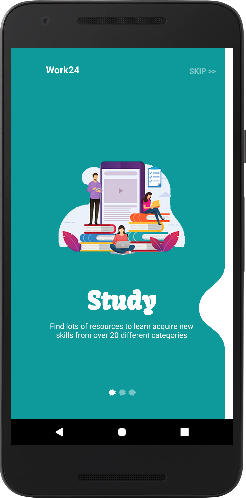

Intro Screen two
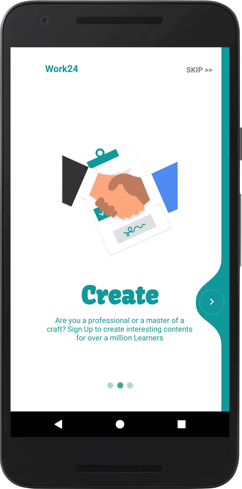

Intro Screen three
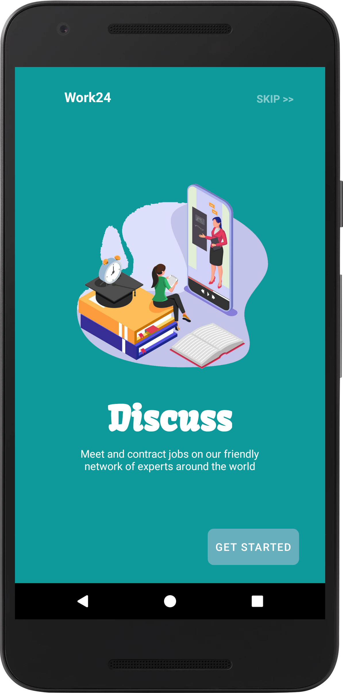

Login Screen
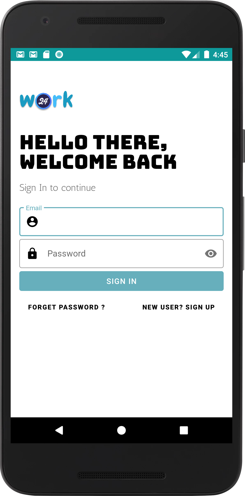

Sign Up Screen
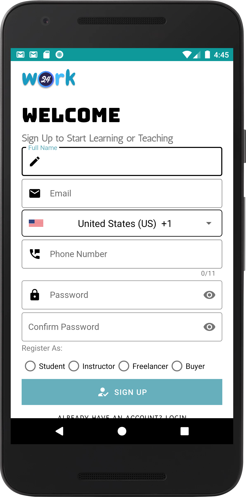

Country Code
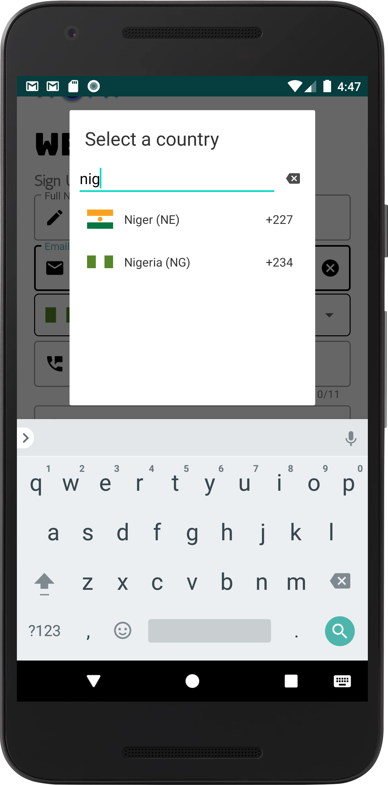

Phone Number Verification 

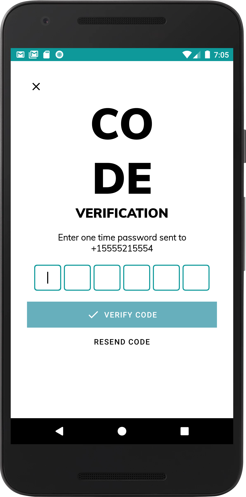

Dashboard
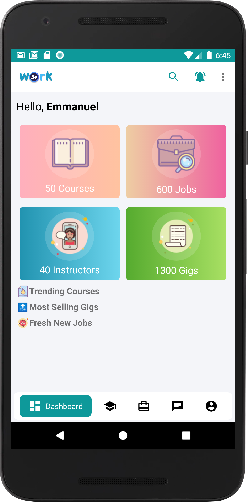

Learn
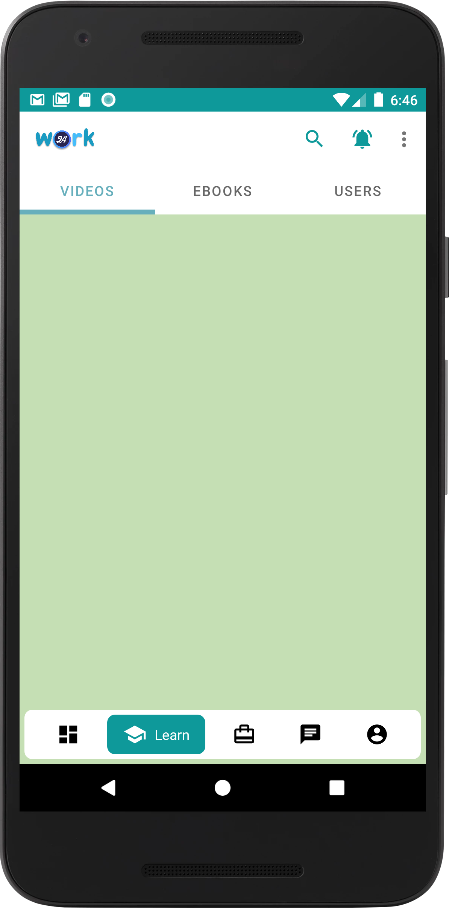

Jobs

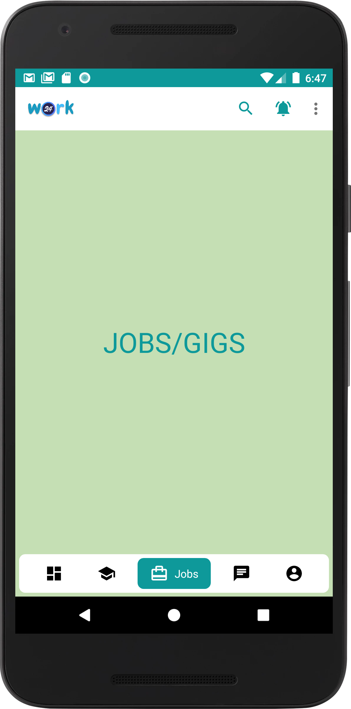

User Profile

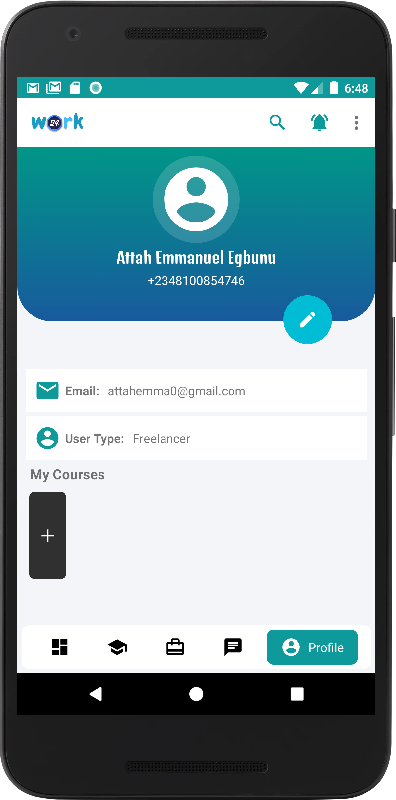

Chat
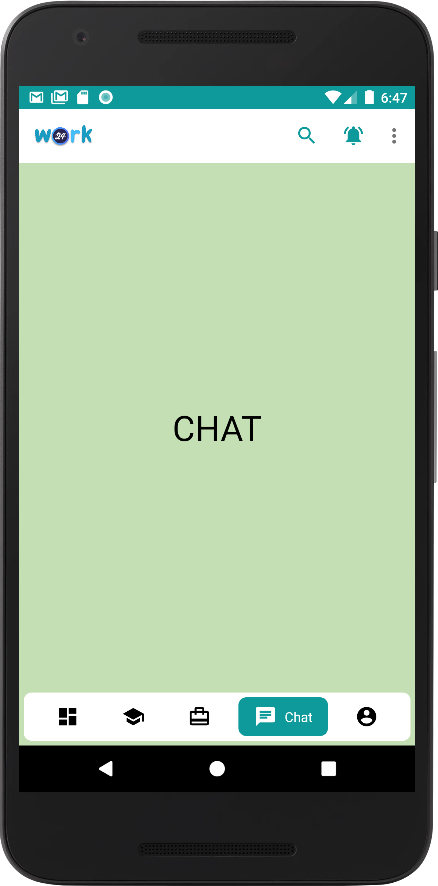
